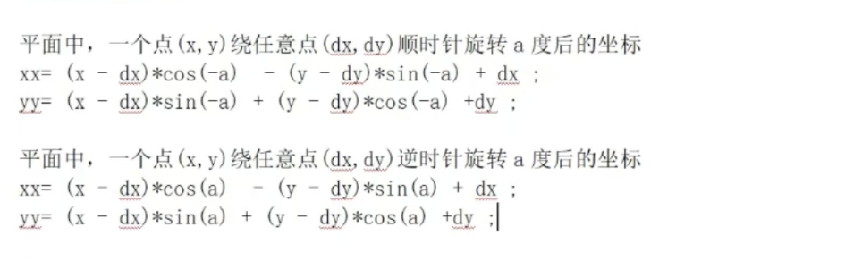
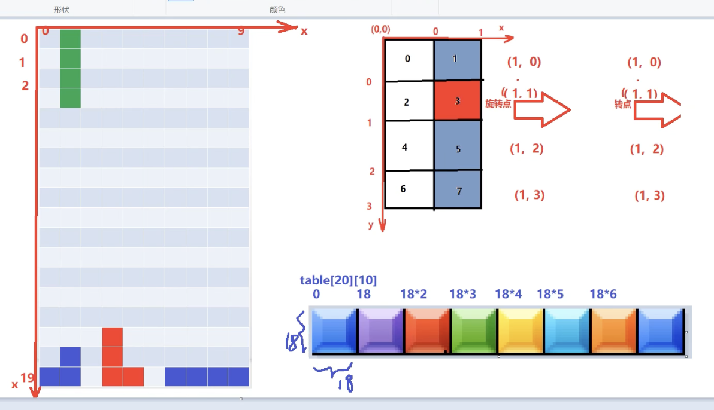

#  <#Title#>
## 1. M1配置SFML：
1. 官方Mac配置文档 
2. Xcode->
    - BuildingSettings-> architecture:改为Standard Architecture(Apple Silicon Intel); Excluded Architectures: 添加arm64（小写）；
    - Building Phases->Run Scripts->For Installs Builds only打勾

## main()

## doRotate()

## keyEvent()

## newBlock()
### - newBlock()把定义好的blocks里的方块根据需要的种类赋予坐标，使他们成为可以放入游戏table的newBlock。

## DrawBlock()

- 偏移量：实际的(0, 0)是背景图的左上方，而非背景图中的游戏区域，所以需要设置偏移量。
1. 已经降落到底部的俄罗斯方块
    - 两层For loop，如果table[i][j] != 0， 那么根据它的值为他绘制对应的格子：
        1. setTextureRect(IntRect()):   set the sub-rec of the texture with the (x, y, width, height)
        2. setPosition(x, y):  j is column, so j is x; i is row, so i is y
        3. move(x, y): 设置偏移量
        4. window->draw(*spriteTiles); draw it out 
    
2. 正在降落中的俄罗斯方块（当前方块）
    - 一层For loop，i < 4， 因为只需画当前的格子：
        1. setTextureRect(IntRect()):   set the sub-rec of the texture with the (x, y, width, height)
        2. setPosition(x, y):  j is column, so j is x; i is row, so i is y
        3. move(x, y): 设置偏移量
        4. window->draw(*spriteTiles); draw it out 
